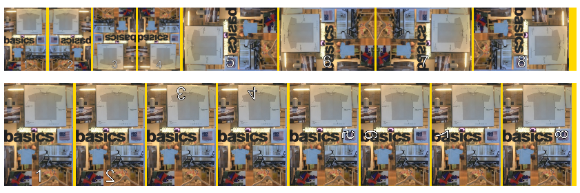

# vue-orientation-image
> A Vue2 component to display images with _exif_ orientation correctly.



At firts, this component will place an `` tag with an svg with virutual
(rotated) width and height of an image to see what display rectangle it will
occupy according to CSS rules. After that, the svg is replaced with an actual
image, and if it has to be rotated, the width and height are set to the
calculated ones. The image is rotated and scaled with CSS transform rules,
making it appear as if with normal orientation.

```js
// doRotate = orientation > 4
// virtualWidth = doRotate ? this.naturalWidth : this.naturalHeight
// virtualWidth = doRotate ? this.naturalHeight : this.naturalWidth

const svg = `<svg xmlns="http://www.w3.org/2000/svg" width="${this.virtualWidth}" height="${this.virtualHeight}" />`
const encoded = encodeURI(svg)
return `data:image/svg+xml,${encoded}`
```

If image width, height and orientation are not given to the component, the
image will be loaded first to access its `naturalWidth` and `naturalHeight`
properties. If _exif_ function is given (e.g., from
[exif-js](https://github.com/exif-js/exif-js)), it will be used to get
orientation. When width, height and orientation are available, all required
data is complete, and the component logic will be performed.

```js
// naturalWidth = imageWidth || this.loadedWidth
// naturalHeight = imageHeight || this.loadedHeight

// metaLoaded = this.naturalWidth && this.naturalHeight && this.exifOrientation
// 

metaLoadedListener(event) {
    const img = event.target
    this.loadedWidth = img.naturalWidth
    this.loadedHeight = img.naturalHeight
}
```

### Props
Name | type | default | description
---:| --- | ---| ---
imageWidth | Number | - | raw image width (regardless of orientation)
imageHeight | Number | - | raw image height (regardless of orientation)
orientation | Number | - | 1 to 8 exif orientation
url | String | - | image src
loadingClass | String | - | class to add while loading the image
exifFn | Function | - | function to be used to get orientation if not given


